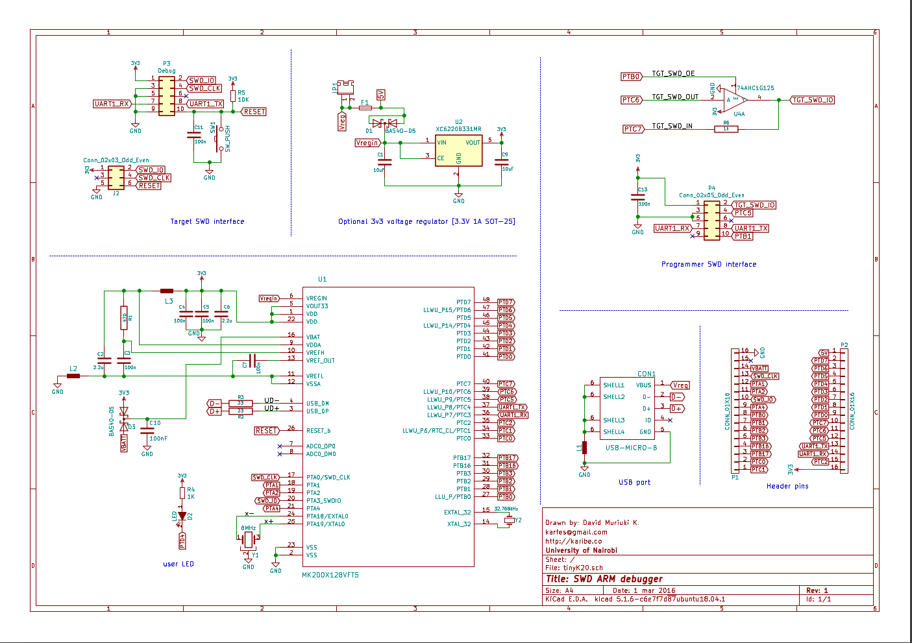
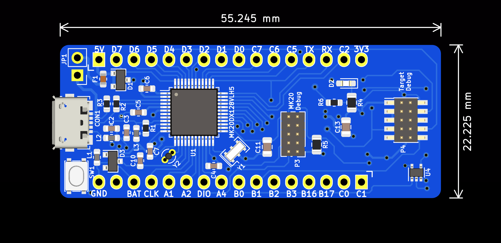
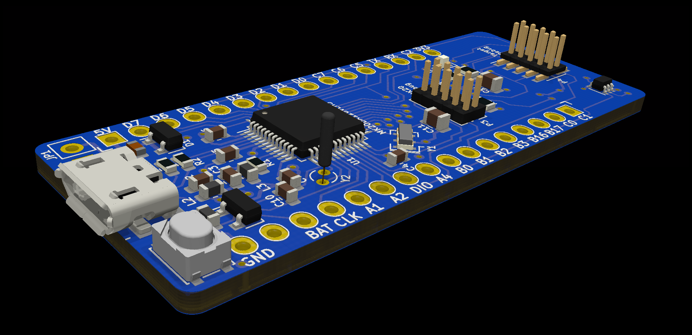
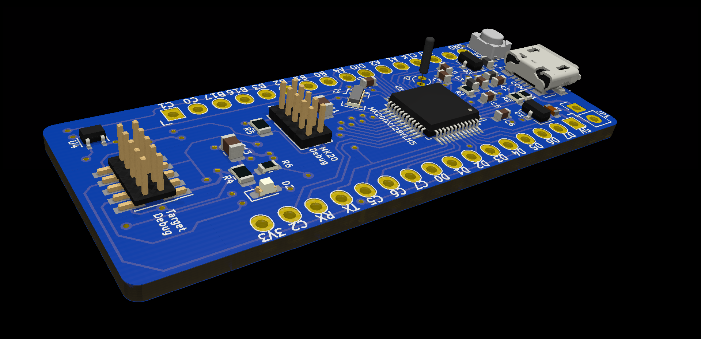

TinyK20 was an idea by Professor Erich Styger [mcuoneclipse.com] to help students have a board that they can use either as a cheap personal ARM debug probe or a prototyping platform.
This is my own version of TinyK20. It is designed in KiCad and all files are included for manufacturing and further modification. It is opensource.

 
## Features 
* MK20DX128VLH5 NXP Microcontroller
* USB device mode with a possibility for 5V power supply
* External 5V to 3.3V regulator on bottom side
* 10 pin 1.27mm ARM SWD debug port to program the K20
* 10 pin 1.27mm ARM SWD debug port to program an external target
* 2.54mm Header pins for using with a breakout board
* RTC crystal oscillator
* A reset button
* A user LED

## To be added 
* An SD card socket
* Bootloader and debug Firmware
* Instructions for baremetal bootloader applications

### Current Schematic

### PCB Layout Preview 

A top preview of the ongoing PCB design

A 3D preview of the current design

### BOM
<a href="" rel="BOM">
